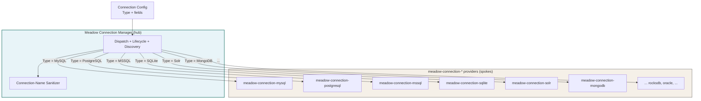
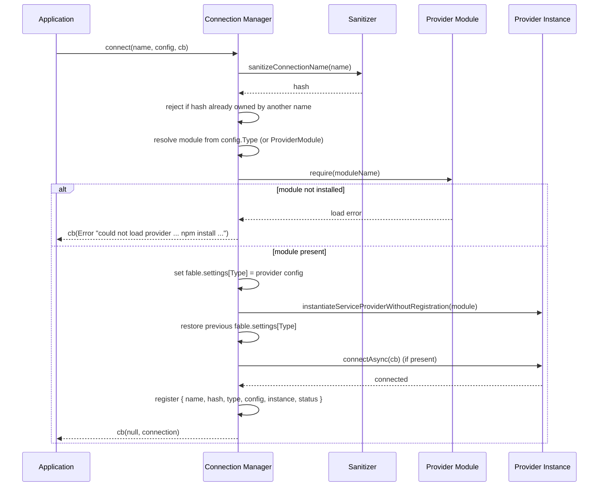
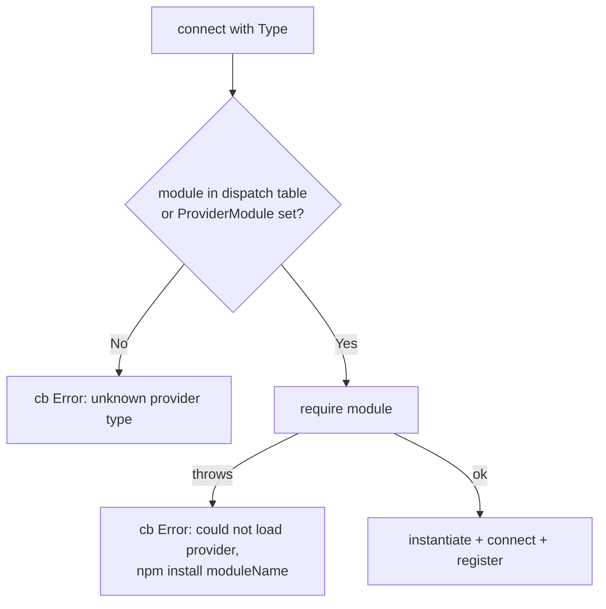
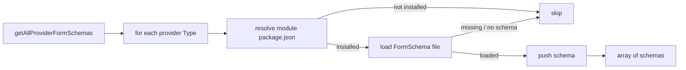
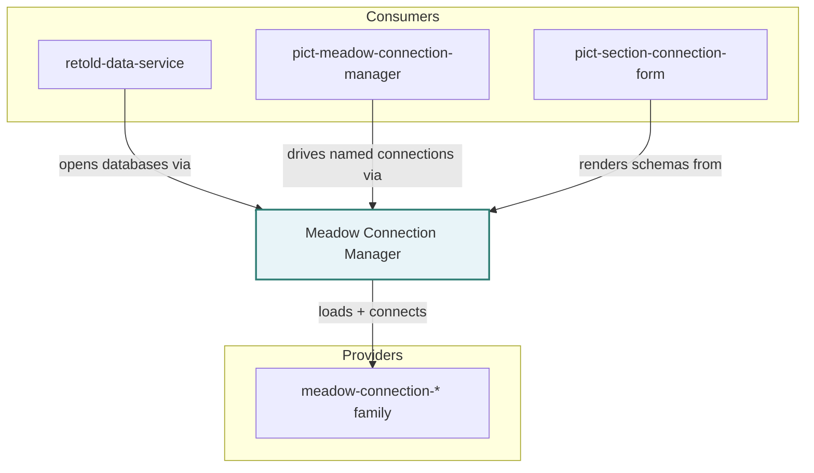

# Architecture

Meadow Connection Manager is a Fable service that turns plain connection configurations into live, named database connections. This page documents the hub-and-spoke design, the type-dispatch table, the connection lifecycle, the graceful-fallback strategy for optional drivers, and the form-schema discovery feed.

---

## Hub and Spoke

The manager is a **hub**. Each `meadow-connection-*` provider is a **spoke** that owns exactly one database engine and its driver. The hub knows how to choose a spoke from a config and drive its lifecycle; it does not know how any individual driver works.



Adding support for a new engine is a matter of publishing a new spoke and adding one row to the hub's dispatch table -- no change to the calling application's connection code.

---

## The Dispatch Table

`connect()` selects a provider by looking up the config's `Type` in a built-in table that maps each type name to an npm module name:

| `Type` | Provider module |
|--------|-----------------|
| `MySQL` | `meadow-connection-mysql` |
| `PostgreSQL` | `meadow-connection-postgresql` |
| `MSSQL` | `meadow-connection-mssql` |
| `Oracle` | `meadow-connection-oracle` |
| `SQLite` | `meadow-connection-sqlite` |
| `Solr` | `meadow-connection-solr` |
| `RocksDB` | `meadow-connection-rocksdb` |
| `MongoDB` | `meadow-connection-mongodb` |
| `Bibliograph` | `bibliograph` |
| `RetoldDataBeacon` | `meadow-connection-retold-databeacon` |
| `MeadowEndpoints` | `meadow-connection-meadow-endpoints` |

A config may override the lookup with an explicit `ProviderModule` field, which the manager `require()`s directly instead of consulting the table. When no `Type` is supplied, the manager falls back to its `DefaultProvider` option (`MySQL` out of the box).

---

## Connection Lifecycle



Three details are worth calling out:

- **Settings hand-off.** Most providers read their configuration from `fable.settings[Type]`. The manager sets that key just before instantiating the provider, lets the constructor read it, then restores whatever value was there before -- so opening one connection never permanently mutates shared Fable settings.
- **Provider config assembly.** If the config has a nested object under its `Type` key, that object is passed through verbatim. Otherwise the manager copies the flat keys, skipping the three reserved keys `Type`, `ProviderModule`, and `Name`.
- **connectAsync optional.** If the provider exposes `connectAsync(cb)` the manager waits for it to succeed before registering. A provider without `connectAsync` is registered immediately after instantiation.

The registered connection record is the unit every query method returns:

```javascript
{
	name:     'analytics',   // the name passed to connect()
	hash:     'analytics',   // sanitized, URL-safe slug of the name
	type:     'PostgreSQL',  // the provider Type
	config:   { /* ... */ }, // the original config object
	instance: { /* ... */ }, // the live provider instance you query through
	status:   'connected'
}
```

---

## Named Connections and Hashing

Each connection is filed under two keys: its **name** and a **hash** derived from that name. The hash is a deterministic, URL-safe slug suitable for namespacing routes (for example `/1.0/{hash}/Book`).

The sanitizer (also exported standalone as `sanitizeConnectionName`):

- NFKD-normalizes and strips combining diacritical marks (`Über` becomes `uber`)
- lowercases
- replaces each run of non-`[a-z0-9]` characters with a single hyphen
- trims leading and trailing hyphens
- caps the result at 64 characters
- throws on empty input or input that sanitizes to an empty string
- is idempotent: `sanitize(sanitize(x)) === sanitize(x)`

Because two distinct names can normalize to the same slug, `connect()` rejects a name whose hash is already owned by a *different* connection, with an error naming the conflicting connection. Reconnecting under the same name is allowed.

---

## Graceful Fallback for Optional Drivers

Every provider is declared as an *optional* peer dependency. The manager is designed so that a missing driver is a runtime condition to report, never a load-time crash.



The same philosophy governs discovery:

- `getAvailableProviders()` probes each type with `require.resolve()` and reports `{ Type: true | false }` -- so a UI can show only the engines that are actually installable.
- `getProviderFormSchema()` / `getAllProviderFormSchemas()` resolve and load each provider's *schema file* (see below) and skip -- returning `null`, or omitting the entry -- any provider whose module or schema file is absent.

This is why the manager can be installed on its own and still answer "what can I connect to?" honestly on any given deployment.

---

## Form-Schema Discovery

Each provider module ships a pure-data **connection-form schema** describing the fields needed to connect to that engine, at a predictable path within the module (most follow `source/Meadow-Connection-<Type>-FormSchema.js`).

The manager loads these schemas **without loading the provider's main entry point**. It resolves the provider's `package.json` via `require.resolve()`, derives the schema-file path from the module directory, and `require()`s the schema file directly. Because the schema file is pure data with no driver `require()`, this works even when the native driver is not installed -- the schema is available as long as the provider module is present.



Each schema has the shape `{ Provider, DisplayName, Description, Fields: [...] }`, where each field carries at least `{ Name, Label, Type }`. This aggregated feed is exactly what [pict-section-connection-form](https://fable-retold.github.io/pict-section-connection-form) renders into a "Connect to X" form, so the field list lives in one canonical place per provider rather than being re-encoded in every UI.

---

## Connection Probing

`testConnection()` exists because connecting is not the same as reaching the database. Lazy-pool drivers (mysql, mysql2, node-postgres) return a pool object before any socket opens, so a misconfigured host, port, or credential surfaces only on the first query. Without a probe, `testConnection()` would report success against an unreachable server.

So `testConnection()` opens the config under a throwaway name, runs a cheap per-type round-trip, then disconnects:

| `Type` | Probe |
|--------|-------|
| `MySQL` / `PostgreSQL` | `pool.query('SELECT 1')` |
| `MSSQL` | `pool.request().query('SELECT 1')` |
| `Oracle` | acquire a connection, `SELECT 1 FROM DUAL` |
| `SQLite` | `db.prepare('SELECT 1').get()` (also opens the file) |
| `MongoDB` | `db.command({ ping: 1 })` |
| `Solr` | `search('q=*:*&rows=0', ...)` (HEAD-equivalent) |
| `RocksDB` / `MeadowEndpoints` / `RetoldDataBeacon` | no-op -- these validate during connect |
| unknown | no-op -- new drivers are not failed closed |

The result is delivered as `{ Success: true }` or `{ Success: false, Error: '...' }`; the error argument of the callback stays `null` in both cases so the caller reads the result object.

---

## Where the Manager Fits in Retold



[retold-data-service](https://fable-retold.github.io/retold-data-service) uses the manager to open the databases it auto-exposes over REST. [pict-meadow-connection-manager](https://fable-retold.github.io/pict-meadow-connection-manager) is the browser-side counterpart for managing named connections, and it delegates form rendering to [pict-section-connection-form](https://fable-retold.github.io/pict-section-connection-form), which consumes the discovered schemas. The spokes themselves are the [meadow-connection-*](https://fable-retold.github.io/meadow-connection-mysql) family.
